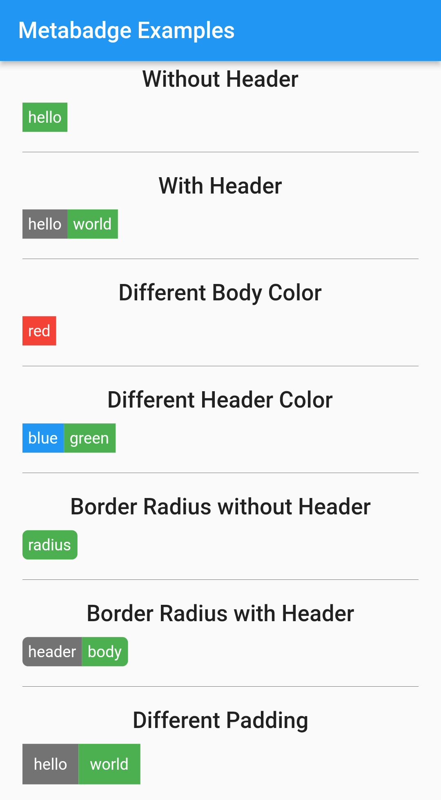

# Metabadge

[](https://pub.dev/packages/metabadge)

A [Shields](https://shields.io/)-like badge widget for Flutter apps.

# Screenshots



# Examples

Check out [example app code](examples/project/lib/main.dart) to see it in use. You can even clone the repository, edit, run and see the changes.

Some quick examples are:

```dart
// only body
Metabadge(
  body: Text('hello', style: Colors.white),
)
// body and header
Metabadge(
  header: Text('hello', style: Colors.white),
  body: Text('world', style: Colors.white),
)
// different background colors
Metabadge(
  header: Text('hello', style: Colors.white),
  body: Text('world', style: Colors.white),
  decoration: MetabadgeDecoration(
    headerColor: Colors.green,
    bodyColor: Colors.blue,
  ),
)
// with radius
Metabadge(
  header: Text('hello', style: Colors.white),
  body: Text('world', style: Colors.white),
  decoration: MetabadgeDecoration(
    radius: 5.0, // default is 0
  ),
)
// with padding
Metabadge(
  header: Text('hello', style: Colors.white),
  body: Text('world', style: Colors.white),
  decoration: MetabadgeDecoration(
    padding: 10.0, // default is 5
  ),
)
```

# Documentation

To check out API docs, [click here](https://pub.dev/documentation/metabadge/latest/).

Or you can simply hover over the classes (such as `Metabadge` or `MetabadgeDecoration`) to see their documentations.